# Arquitectura — Agent Office

---

## 1. Visão geral do sistema

Agent Office corre como um conjunto de serviços Docker. Todo o tráfego entra pelo Nginx (porta 80) que faz proxy para o frontend Next.js ou para o backend FastAPI conforme o path.

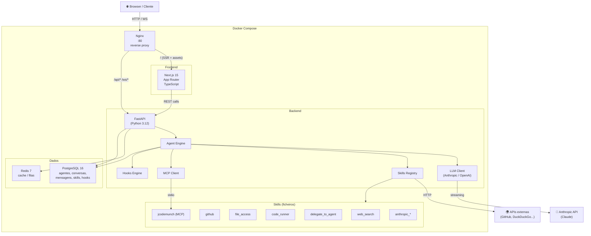

---

## 2. Routing HTTP e WebSocket

O Nginx decide para onde encaminhar cada pedido:

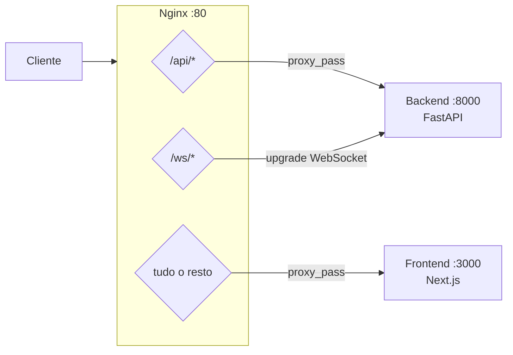

---

## 3. Fluxo de autenticação

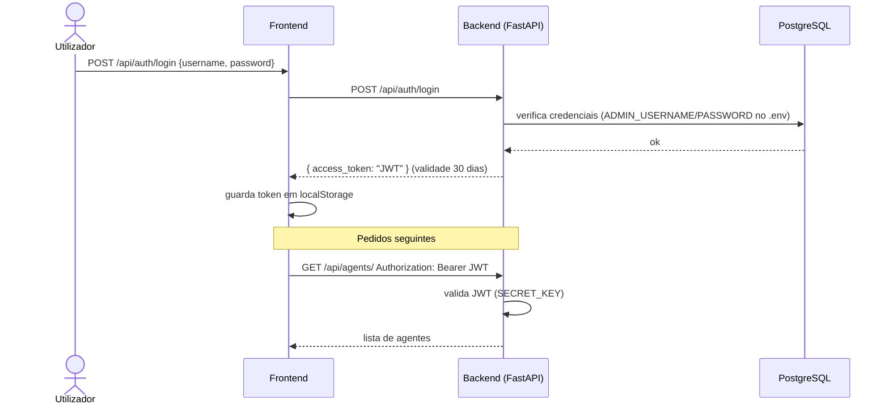

---

## 4. Fluxo de uma mensagem de chat (WebSocket)

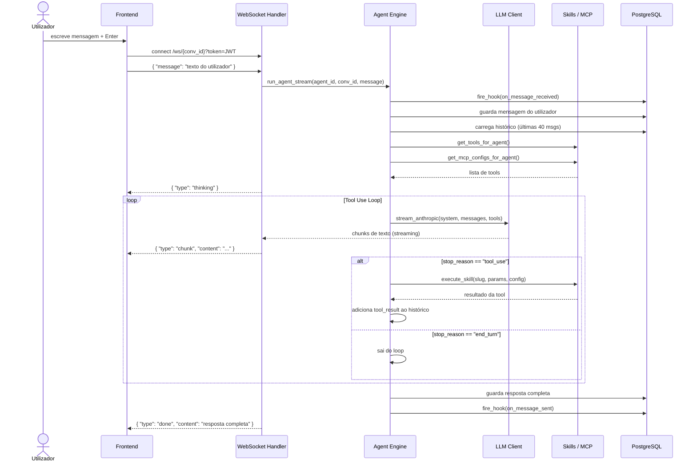

---

## 5. Agent Engine — fluxo detalhado

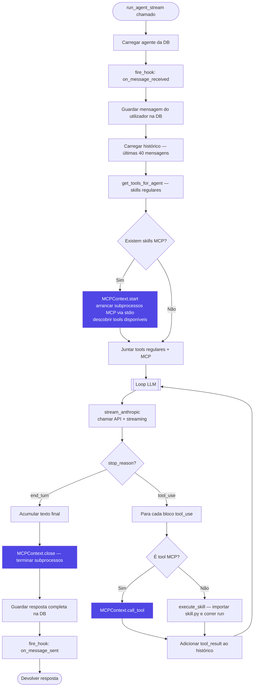

---

## 6. Sistema de skills

### Três tipos de skills

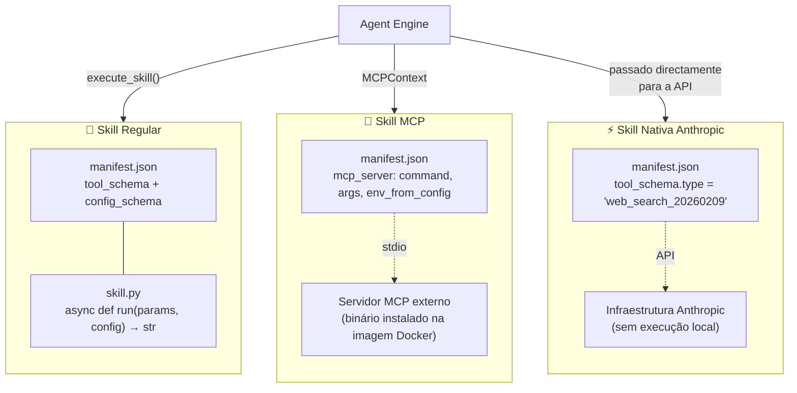

### Ciclo de vida das skills MCP

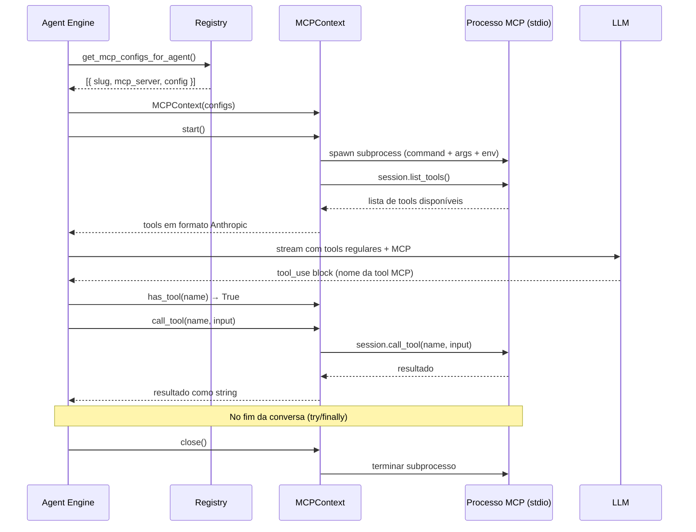

---

## 7. Sistema de hooks

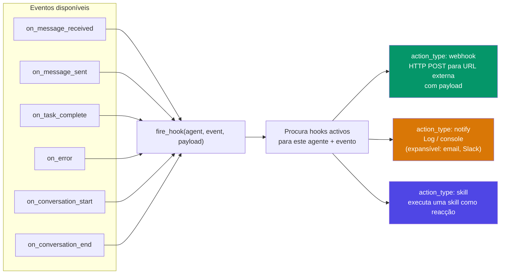

---

## 8. Modelo de dados

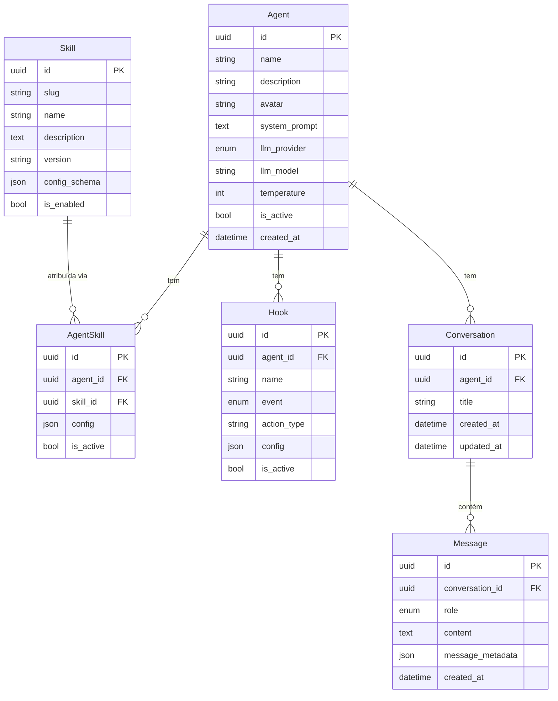

---

## 9. Estrutura do frontend

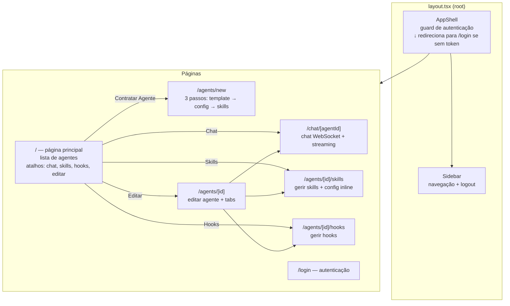

---

## 10. Criação de um agente — fluxo de 3 passos

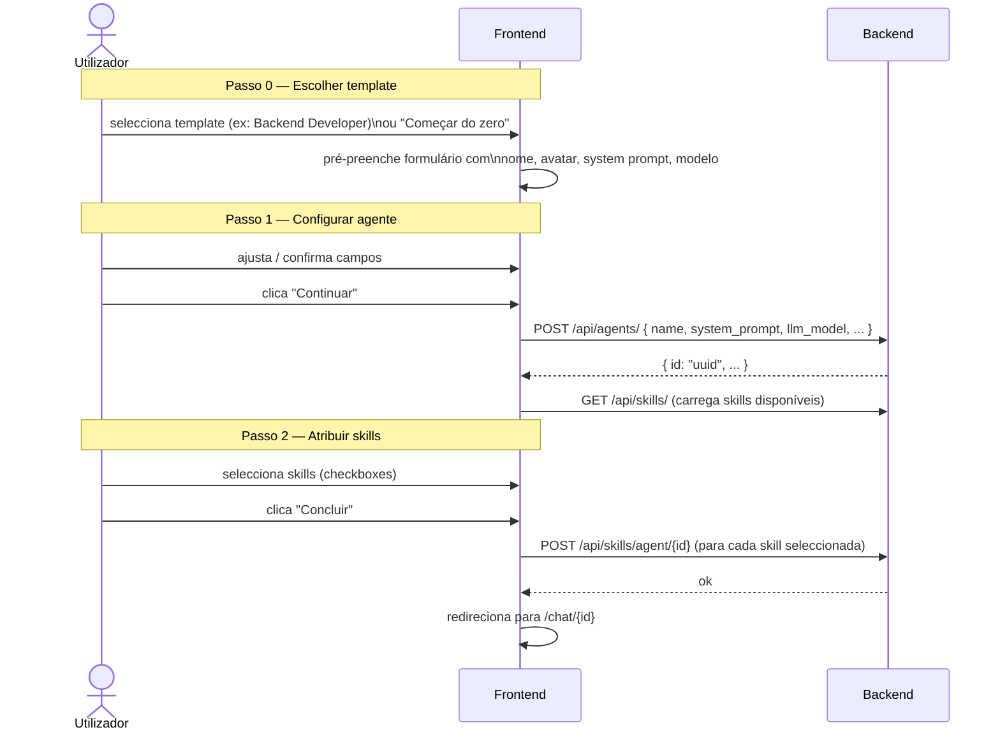
